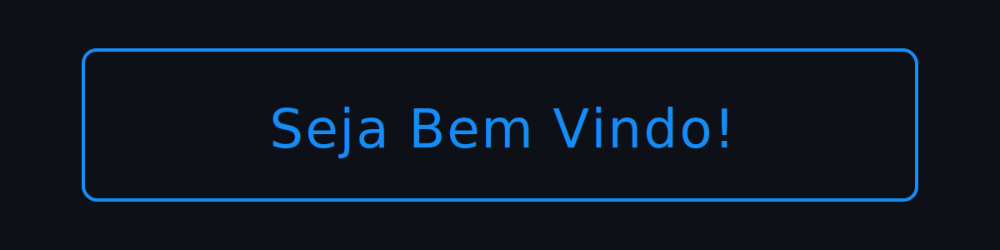
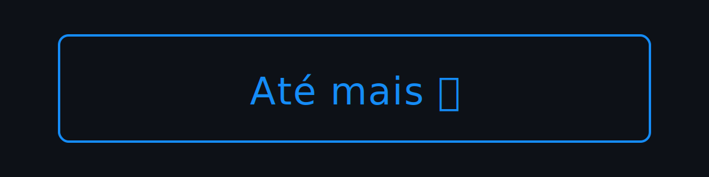

<!--  -->

<!--  -->

<!--  -->

<!--  -->

<!--  -->

<!--  -->

<!-- 0D1117 -->
<!-- 158CF7 -->

<h1 align="center"> 
  
</h1>

<h3 align="center">
  Um desenvolvedor apaixonado por programação do Brasil 🇧🇷
</h3>

  &nbsp;&nbsp;

##

<h2 align="center">

</h2>

<!-- <picture decoding="async" loading="lazy">
  <source media="(prefers-color-scheme: light)" srcset="https://pixel-profile.vercel.app/api/github-stats?username=DiogoAug16&theme=summer">
  <source media="(prefers-color-scheme: dark)" srcset="https://pixel-profile-ui.vercel.app/api/github-stats?username=DiogoAug16&screen_effect=true&include_all_commits=true&pixelate_avatar=true&theme=fuji&theme=fuji&color=%23313638FF">
  
</picture> -->

  

  

##

<!-- <h2 align="center">
  
</h2>

 

  
  
<!-- 
 -->

<h2 align="center">

</h2>

<h3>Frameworks e Runtimes</h3>

  

<h3>Front-end</h3>

  

<h3>Linguagens de Programação</h3>

  

<h3>DevOps e Contêineres</h3>

  

<h3>IDE's e Editores de Código</h3>

  

<h3>Bancos de Dados</h3>

  

<h3>Ferramentas de Desenvolvimento</h3>

  

##

<h2 align="center">
  
  
</h2>

 

  

###

<!-- <!--  -->

<!--  -->

<!--  -->

<!--  -->

